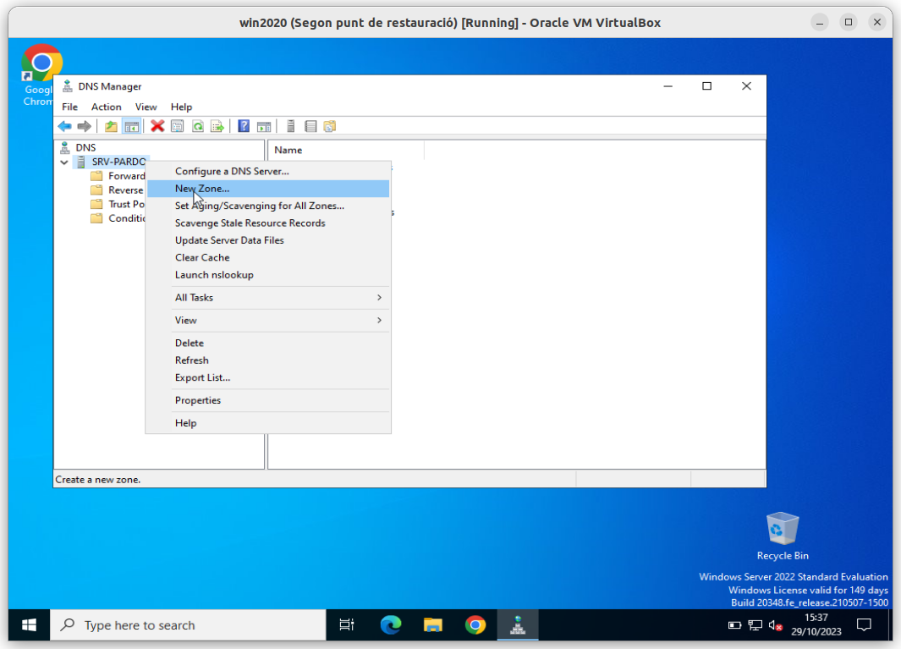
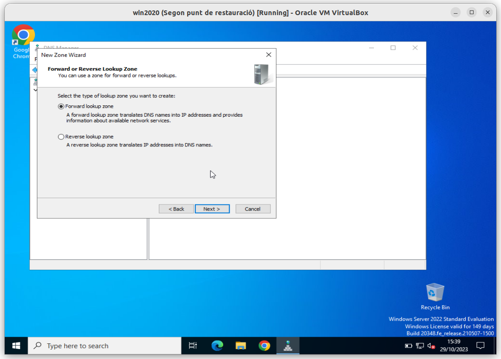
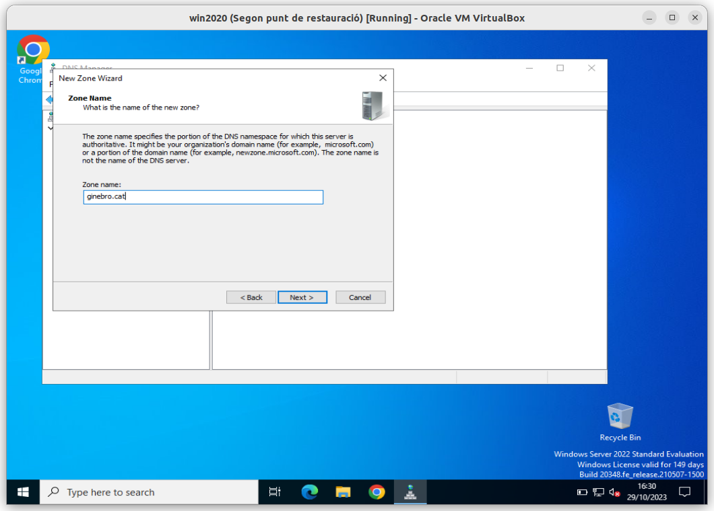
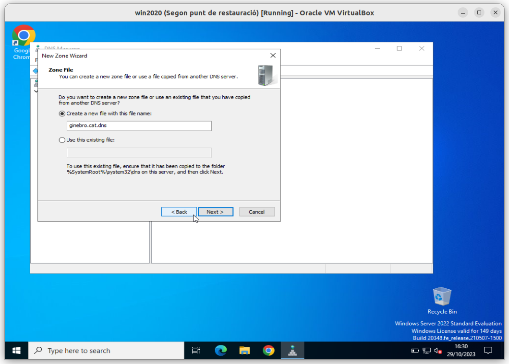
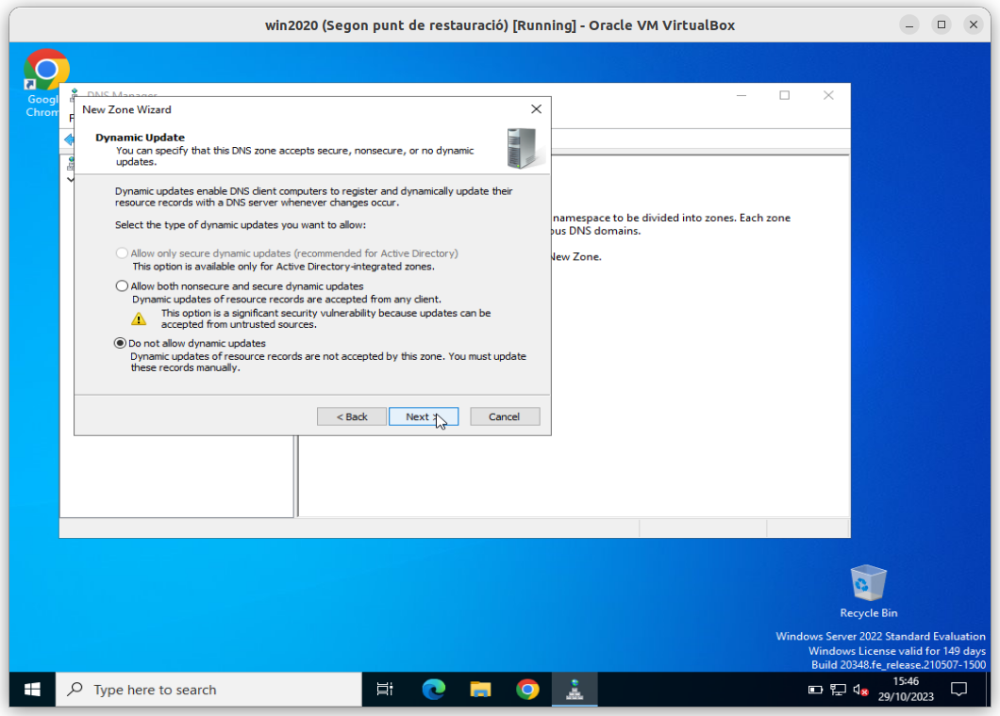
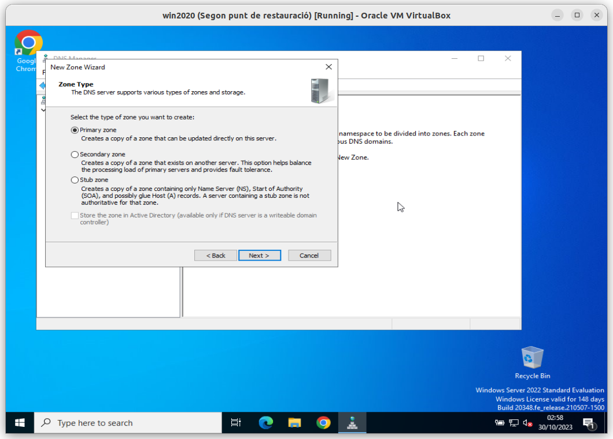
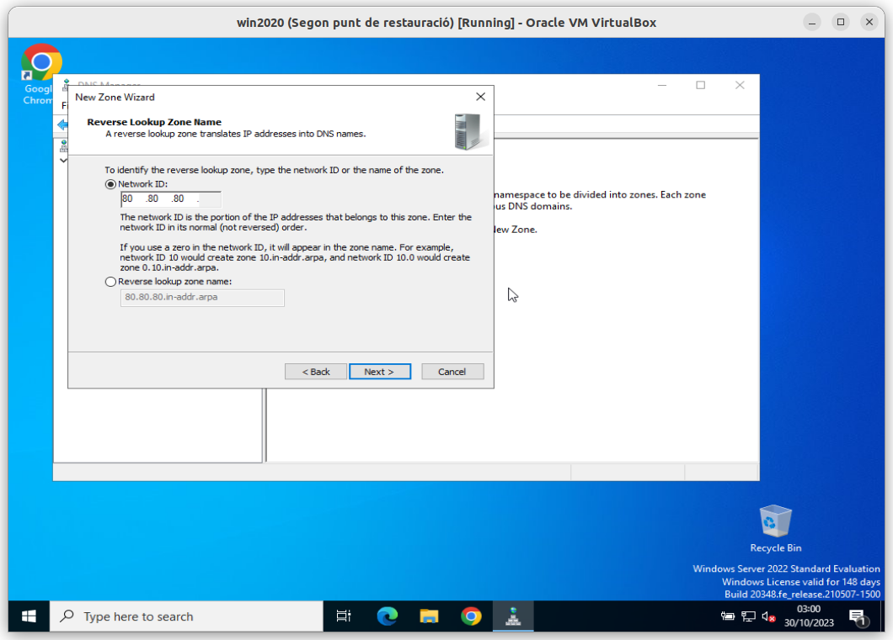
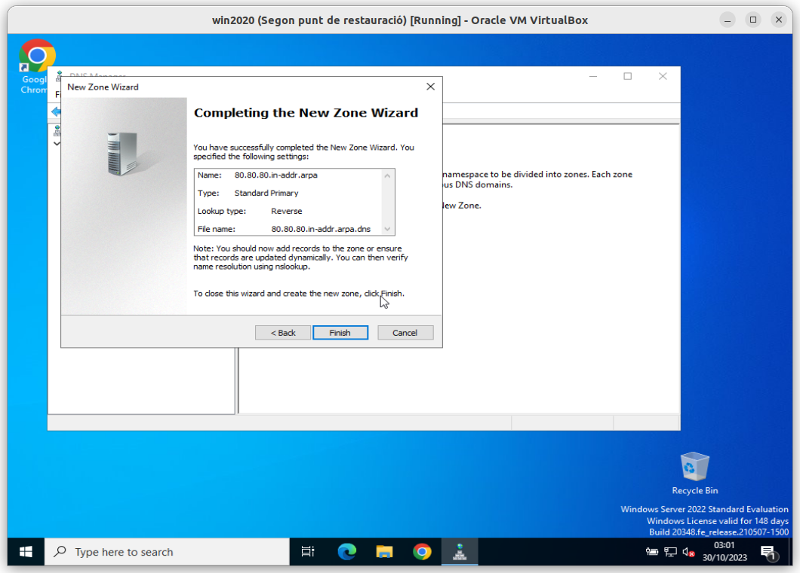

# a04u-configuracio-servidor-dns-win2020

## Objectiu

Creació d'una nova zona de **```DNS```** en un servidor **Windows 2020 Server**.

> ## Parteixo de la premissa de que ja heu fet l'activitat a on vàreu instal·lar el **servei ```DNS```** al vostre servidor i que ja heu creat la zona **```ginebro.cat```**, tal i com s'indicava a l'activitat. 

## Eines

Per tal de dur a terme la pràctica la instal·lació s'implementarà sobre una màquina **Windows 2020 Server**, a la que ja teniu instal·lat el **servei de DHCP** de l'anterior activitat.

## Ajuda

Al repositori [xuleta-markdown](https://github.com/joanpardogine/xuleta-markdown), trobareu informació sobre les comandes a fer servir a **```markdown```**.

## Procediment 

**1.** Cal crear un **repositori remot** (en el vostre compte de **```github```**) anomenat:

**```<CognomAlumne>-mp07-uf01-04-dns-win2020```**

on **```<CognomAlumne>```** serà **només** el vostre **cognom** **sense el nom**. Per exemple, en el meu cas seria **```pardo-mp07-uf01-04-dns-win2020```**.

**2.** Cal que el **repositori remot** sigui **```privat```**.

**3.** Cal que convideu a l'usuari **```joanpardogine```** al **repositori remot**.

**4** En el fitxer **```README.md```** del vostre **repositori remot**, haurà de quedar reflectit tots els passos que heu seguit per assolir el que es demana a l'activitat. És a dir, cal que, de cada pas, hi hagi:

   * **4.1** un **titol** del pas en qüestió,

   * **4.2** una **explicació detallada** de com heu fet aquest pas, i si, s'escau,
  
   * **4.3** una **captura de pantalla** al fitxer **```README.md```** del vostre **repositori remot**.

> ## L'**objectiu final** és que seguint la vostra explicació sigui possible assolir l'objectiu de l'activitat sense cap problema.


## Dades especifiques de l'activitat

Fent referència a les explicacions de l'activitat a on vàreu instal·lar el **servei ```DNS```** al vostre servidor, indico els passos a seguir:

Abans de crear res en el servidor o configurar la nova zona al servidor DNS, cal obtenir **TOTS els registres ```DNS```** específics per la vostra activitat. Aquesta informació caldrà que quedi reflectida al fitxer **```README.md```** del vostre **repositori remot**.

### ***Pas 1***: Obtenció del vostre domini per aquesta activitat.

Primer cal identificar el **domini principal** i el **domini de la família**, el seu símil **```FQDN```** podria ser:

El domini serà el següent: **```<CognomAlumne>.cat```**

on **```<CognomAlumne>```** serà **només** el vostre **cognom** **sense el nom**. Per exemple, en el meu cas seria **```pardo.cat```**.

|Domini|Valor|Comentari|
|---|---|---|
|Domini principal|**```.cat```**|En aquest cas és el **territorial**, però també hi ha<br>el **```.com```**, **```.es```**, **```.net```**, **```.org```**, etc.|
|El vostre **cognom**|**```<CognomAlumne>```**|On s’identifica el grup amb el vostre cognom|

### ***Pas 2***: Obtenció dels vostres registres de tipus **```A```**. 

Ara toca crear els **```hosts```** (o **registres de tipus** **```A```**) que relacionen un **nom** amb una **adreça IP**.

Cal que creeu un minim de **```15```** **registres de tipus** **```A```** seguint el següent criteri.

Els registres cal que siguin els **noms** i el **primer cognom** de persones del vostre entorn familiar o d'amistats, començant amb el vostre **propi nom** i **cognom** i el **nom** i **cognom** de les persones que vulgueu. Tingueu en compte posteriorment caldrà que creeu **alias**. Una vegada més, fent referència a les explicacions de l'activitat a on vàreu instal·lar el **servei ```DNS```** al vostre servidor, un exemple seria:

|Nom (reg. **tipus ```A```**)|**```Adreça IP```**|
|---|---|
|**```mariaexposito```**|**```80.80.80.81```**|
|**```marclurbe```**|**```80.80.80.81```**|

En aquest cas, fareu servir una **adreça IP** inventada per vosaltres i seguint els següents punt:

**1.** Cal que sigui una **adreça IP** de **Class A**, (Per més informació podeu veure [Definició d'adreçament amb classe](./teoria-classes-ip.md))

**2.** Les quatre parts de l'adreça **Class A** serà seguint el següent **patró**:

  * **2.1** la **primera part** de l'**adreça IP** serà un número inventat per vosaltres. Cal que recordeu que ha de ser una **adreça IP** de **Class A**,

  * **2.2** la **segona part** ha de ser **el dia** de la data del vostre naixement,

  * **2.3** la **tercera part** ha de ser **el mes** de la data del vostre naixement, i per últim 

  * **2.3** la **quarta part** ha de ser **els dos últims números de l'any** de la data del vostre naixement.

Com ja s'ha comentat cal que al fitxer **```README.md```** del vostre **repositori remot**, aparegui una taula amb els **registres ```DNS```** de tipus **```A```**'s que heu creat, com la següent:

|Nom|Adreça IP|
|---|---|
|**```mariaexposito```**|**```80.80.80.81```**|
|**```marclurbe```**|**```80.80.80.81```**|

### ***Pas 3***: Obtenció dels vostres registres de tipus **```CNAME```**. 

Ara toca crear els **```alies```** (o **registres de tipus** **```CNAME```**) que relacionen un **nom** amb un altre **nom**.

Cal que creeu un minim de **```10```** **registres de tipus** **```CNAME```** seguint el següent criteri.

Els registres cal que siguin el parentiu de persones del vostre entorn familiar o d'amistats. Començarem amb el vostre propi **```alias```**, que serà **```jomateix```** i que serà un **```alias```** del **registres de tipus** **```A```** que heu creat amb el vostre nom.

Com ja s'ha comentat cal que al fitxer **```README.md```** del vostre **repositori remot**, aparegui una taula amb els **registres ```DNS```** de tipus **```CNAME```**'s que heu creat, com la següent:

|Sobrenom (**```CNAME```**)|Nom (reg. **tipus ```A```**)|
|---|---|
|**```director-pedagogic```**|**```mariaexposito.ginebro.cat```**|
|**```cap-estudis```**|**```marclurbe.ginebro.cat```**|

### ***Pas 4***: Obtenció dels vostre registre de tipus **```MX```**. 

Una vegada més, es fa referència a les explicacions de l'activitat a on vàreu instal·lar el **servei ```DNS```** al vostre servidor.

Alguns **serveis especials**, com el cas del **servei de correu electrònic** (**```registre MX```**) que relaciona un domini amb el **```HOST```** on s’ha d’**entregar el correu**.

Seguint l’exemple, es pot informar al carter que quan porti una carta la deixi **a la bústia**. Que no cal que busqui a la persona en concret, ells ja s’ocuparan de distribuir-la:

En el vostre cas, només caldrà obtenir un **registre ```DNS```** de **tipus** **```MX```**.

|Domini|Nom|
|---|---|
|**```correu.<CognomAlumne>.cat```**|**```jomateix.<CognomAlumne>.cat```**|

Un cop que ja tenim tota la informació, ja podem procedir a fer l'activitat.

### ***Pas 5***: Creació d'una nova **zona de DNS**. 

En les imatges, com deia hi ha l'exemple de l'activitat a on vàreu instal·lar el **servei ```DNS```** al vostre servidor, però cal que les segui amb les dades que un indico a continuació:

Creació d'una nova zona directa.

**Nom de la zona directa**: **```<CognomAlumne>.cat```**

on **```<CognomAlumne>```** serà **només** el vostre **cognom** **sense el nom**. Per exemple, en el meu cas seria **```pardo.cat```**








És en aquest punt que en comptes de **```ginebro.cat```** cal fer servir el vostre **nom de la zona directa** (**```<CognomAlumne>.cat```**).






Ja hem creat la nova **zona directa** **```<CognomAlumne>.cat```**

### ***Pas 6***: Creació d'una nova **zona inversa**. 

Com ja s'ha comentat anteriorment, a les imatges, hi ha l'exemple de l'activitat a on vàreu instal·lar el **servei ```DNS```** al vostre servidor, però cal que les segui amb les dades vostres, i **no les de l'activitat** a on vàreu instal·lar el **servei ```DNS```**.










### ***Pas 6***: Creació dels **registres de tipus** **```A```**

Ara toca crear els **```hosts```** (o **registres de tipus** **```A```**) que relacionen un nom amb una **adreça IP**.

Ara si que l'opció de crear el **registre ```PTR```** associat pot estar marcada, ja que ja tenim la **zona inversa** creada.


### ***Pas 7***: Creació dels **registres de tipus** **```CNAME```**

Ara toca crear els **```SOBRENOMS```** (o **registres de tipus** **```CNAME```**) que relacionen un nom amb un altre nom.

### ***Pas 8***: Creació dels **registres de tipus** **```MX```**

Ara toca crear els **serveis especials**, com és el cas del **servei de correu electrònic** (**```registre MX```**) que relaciona un domini amb el **```HOST```** on s’ha d’**entregar el correu**.

### ***Pas 9***: Comprovació de la correcta configuració del **servei ```DNS```**

Proposa com a mínim 15 consultes a on es vegi que el vostre servidor DNS respon correctament.

Per exemple:

Si es consulta el registre DNS de tipus CNAME **```jomateix```** la resposta és el **registres de tipus** **```A```** que heu creat amb el vostre nom.
